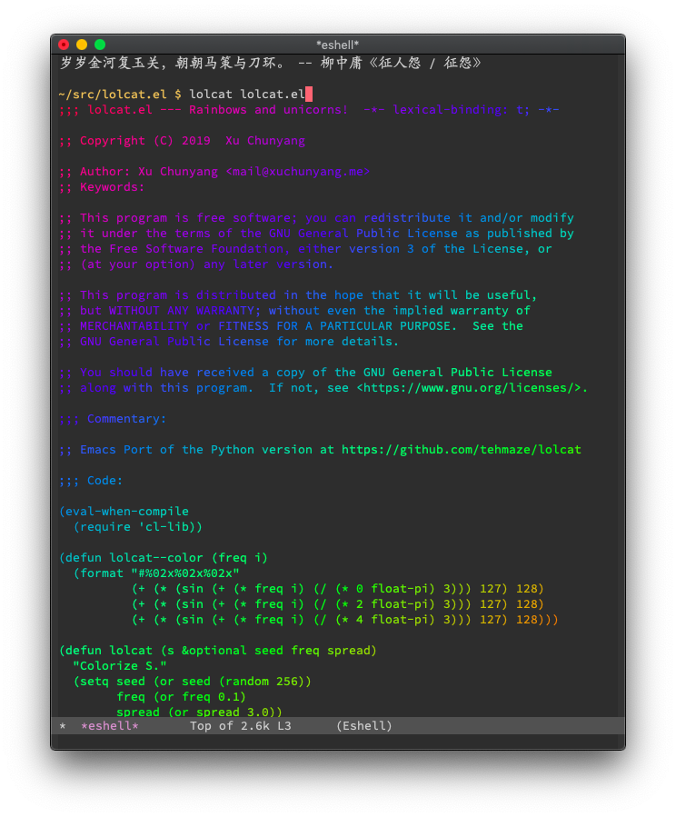

# Emacs Port of LOLcat

The original [LOLcat](https://github.com/busyloop/lolcat) is written in Ruby. This Emacs version is ported from the [Python version](https://github.com/tehmaze/lolcat).

## Screenshot

Running `$ lolcat lolcat.el` in Eshell:

## Usage

### `M-x lolcat-view-file FILE`

View `FILE` in color.

### `M-x lolcat-view-buffer BUFFER`

View `BUFFER` in color.

### `M-x lolcat-this-buffer`

Colorize the current buffer.

### `eshell/lolcat`

The Eshell command.

_Unfortunately, Eshell doesn't support `STDIN`, so `$ fortune | cowsay | lolcat` won't work in Eshell._

### `(lolcat s &optional seed freq spread)`

The public API.
